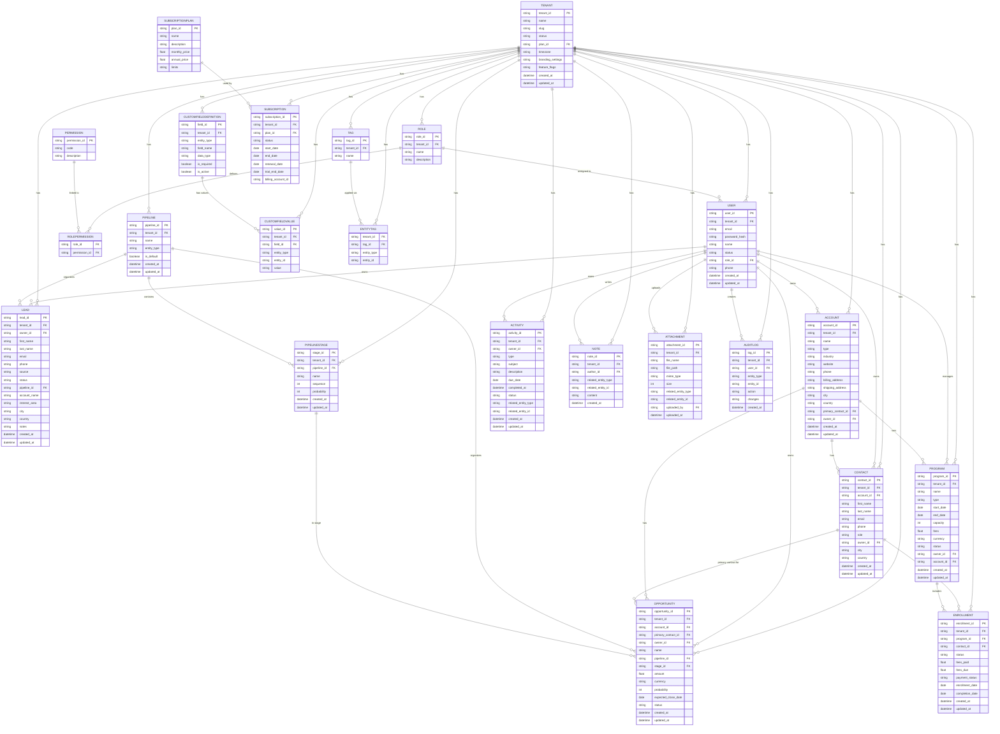

```mermaid
erDiagram

    TENANT {
        string tenant_id PK
        string name
        string slug
        string status
        string plan_id FK
        string timezone
        string branding_settings
        string feature_flags
        datetime created_at
        datetime updated_at
    }

    USER {
        string user_id PK
        string tenant_id FK
        string email
        string password_hash
        string name
        string status
        string role_id FK
        string phone
        datetime created_at
        datetime updated_at
    }

    ROLE {
        string role_id PK
        string tenant_id FK
        string name
        string description
    }

    PERMISSION {
        string permission_id PK
        string code
        string description
    }

    ROLEPERMISSION {
        string role_id FK
        string permission_id FK
    }

    LEAD {
        string lead_id PK
        string tenant_id FK
        string owner_id FK
        string first_name
        string last_name
        string email
        string phone
        string source
        string status
        string pipeline_id FK
        string account_name
        string interest_area
        string city
        string country
        string notes
        datetime created_at
        datetime updated_at
    }

    ACCOUNT {
        string account_id PK
        string tenant_id FK
        string name
        string type
        string industry
        string website
        string phone
        string billing_address
        string shipping_address
        string city
        string country
        string primary_contact_id FK
        string owner_id FK
        datetime created_at
        datetime updated_at
    }

    CONTACT {
        string contact_id PK
        string tenant_id FK
        string account_id FK
        string first_name
        string last_name
        string email
        string phone
        string role
        string owner_id FK
        string city
        string country
        datetime created_at
        datetime updated_at
    }

    PIPELINE {
        string pipeline_id PK
        string tenant_id FK
        string name
        string entity_type
        boolean is_default
        datetime created_at
        datetime updated_at
    }

    PIPELINESTAGE {
        string stage_id PK
        string tenant_id FK
        string pipeline_id FK
        string name
        int sequence
        int probability
        datetime created_at
        datetime updated_at
    }

    OPPORTUNITY {
        string opportunity_id PK
        string tenant_id FK
        string account_id FK
        string primary_contact_id FK
        string owner_id FK
        string name
        string pipeline_id FK
        string stage_id FK
        float amount
        string currency
        int probability
        date expected_close_date
        string status
        datetime created_at
        datetime updated_at
    }

    ACTIVITY {
        string activity_id PK
        string tenant_id FK
        string owner_id FK
        string type
        string subject
        string description
        date due_date
        datetime completed_at
        string status
        string related_entity_type
        string related_entity_id
        datetime created_at
        datetime updated_at
    }

    NOTE {
        string note_id PK
        string tenant_id FK
        string author_id FK
        string related_entity_type
        string related_entity_id
        string content
        datetime created_at
    }

    PROGRAM {
        string program_id PK
        string tenant_id FK
        string name
        string type
        date start_date
        date end_date
        int capacity
        float fees
        string currency
        string status
        string owner_id FK
        string account_id FK
        datetime created_at
        datetime updated_at
    }

    ENROLLMENT {
        string enrollment_id PK
        string tenant_id FK
        string program_id FK
        string contact_id FK
        string status
        float fees_paid
        float fees_due
        string payment_status
        date enrollment_date
        date completion_date
        datetime created_at
        datetime updated_at
    }

    CUSTOMFIELDDEFINITION {
        string field_id PK
        string tenant_id FK
        string entity_type
        string field_name
        string data_type
        boolean is_required
        boolean is_active
    }

    CUSTOMFIELDVALUE {
        string value_id PK
        string tenant_id FK
        string field_id FK
        string entity_type
        string entity_id
        string value
    }

    TAG {
        string tag_id PK
        string tenant_id FK
        string name
    }

    ENTITYTAG {
        string tenant_id FK
        string tag_id FK
        string entity_type
        string entity_id
    }

    ATTACHMENT {
        string attachment_id PK
        string tenant_id FK
        string file_name
        string file_path
        string mime_type
        int size
        string related_entity_type
        string related_entity_id
        string uploaded_by FK
        datetime uploaded_at
    }

    AUDITLOG {
        string log_id PK
        string tenant_id FK
        string user_id FK
        string entity_type
        string entity_id
        string action
        string changes
        datetime created_at
    }

    SUBSCRIPTIONPLAN {
        string plan_id PK
        string name
        string description
        float monthly_price
        float annual_price
        string limits
    }

    SUBSCRIPTION {
        string subscription_id PK
        string tenant_id FK
        string plan_id FK
        string status
        date start_date
        date end_date
        date renewal_date
        date trial_end_date
        string billing_account_id
    }

    TENANT ||--o{ USER : has
    TENANT ||--o{ ROLE : has
    TENANT ||--o{ LEAD : has
    TENANT ||--o{ ACCOUNT : has
    TENANT ||--o{ CONTACT : has
    TENANT ||--o{ PIPELINE : has
    TENANT ||--o{ PIPELINESTAGE : has
    TENANT ||--o{ OPPORTUNITY : has
    TENANT ||--o{ ACTIVITY : has
    TENANT ||--o{ NOTE : has
    TENANT ||--o{ PROGRAM : has
    TENANT ||--o{ ENROLLMENT : has
    TENANT ||--o{ CUSTOMFIELDDEFINITION : has
    TENANT ||--o{ CUSTOMFIELDVALUE : has
    TENANT ||--o{ TAG : has
    TENANT ||--o{ ENTITYTAG : has
    TENANT ||--o{ ATTACHMENT : has
    TENANT ||--o{ AUDITLOG : has
    TENANT ||--o{ SUBSCRIPTION : has

    ROLE ||--o{ USER : "assigned to"
    ROLE ||--o{ ROLEPERMISSION : "defines"
    PERMISSION ||--o{ ROLEPERMISSION : "linked to"

    USER ||--o{ LEAD : "owns"
    USER ||--o{ ACCOUNT : "owns"
    USER ||--o{ CONTACT : "owns"
    USER ||--o{ OPPORTUNITY : "owns"
    USER ||--o{ ACTIVITY : "owns"
    USER ||--o{ NOTE : "writes"
    USER ||--o{ PROGRAM : "manages"
    USER ||--o{ ATTACHMENT : "uploads"
    USER ||--o{ AUDITLOG : "creates"

    ACCOUNT ||--o{ CONTACT : "has"
    ACCOUNT ||--o{ OPPORTUNITY : "has"
    ACCOUNT ||--o{ PROGRAM : "runs"

    CONTACT ||--o{ ENROLLMENT : "participates in"
    CONTACT ||--o{ OPPORTUNITY : "primary contact for"

    PIPELINE ||--o{ PIPELINESTAGE : "contains"
    PIPELINE ||--o{ LEAD : "organizes"
    PIPELINE ||--o{ OPPORTUNITY : "organizes"

    PIPELINESTAGE ||--o{ OPPORTUNITY : "in stage"

    PROGRAM ||--o{ ENROLLMENT : "includes"

    CUSTOMFIELDDEFINITION ||--o{ CUSTOMFIELDVALUE : "has values"

    TAG ||--o{ ENTITYTAG : "applied via"

    SUBSCRIPTIONPLAN ||--o{ SUBSCRIPTION : "used by"
```
